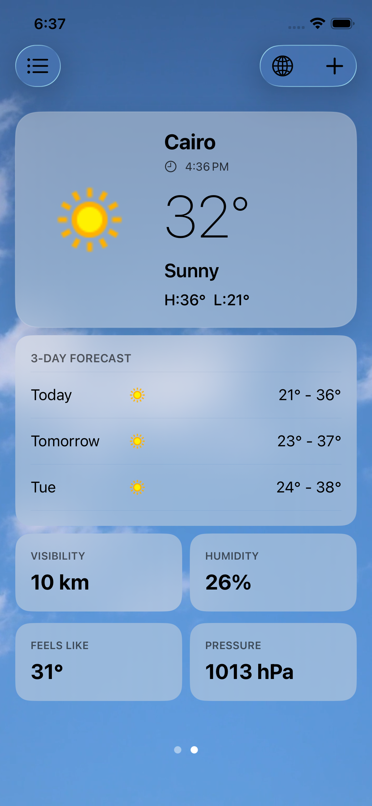
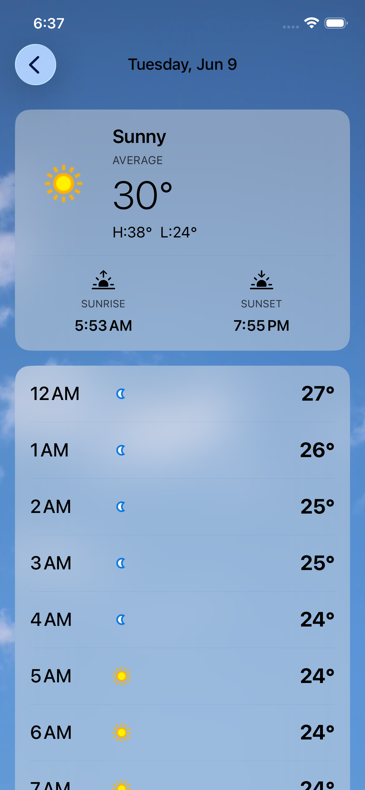
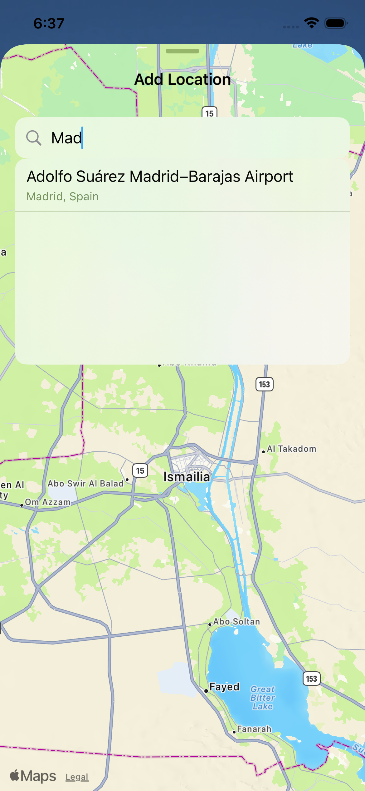
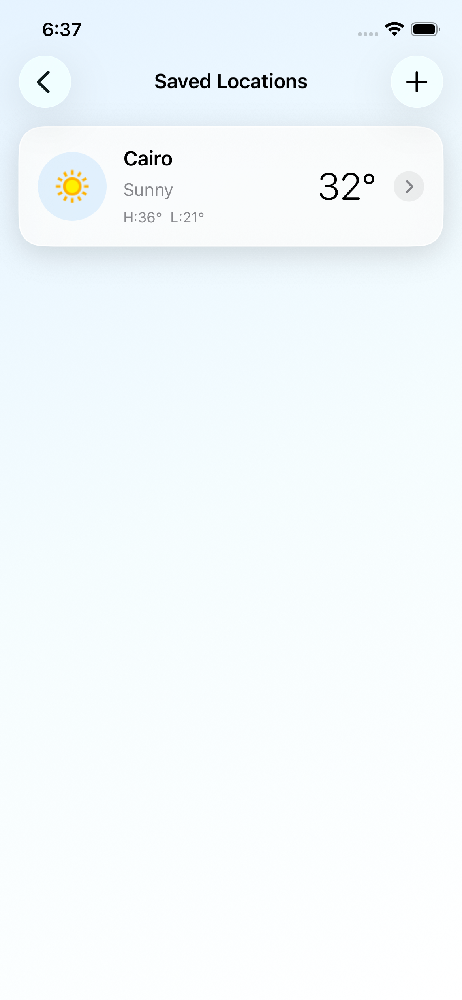
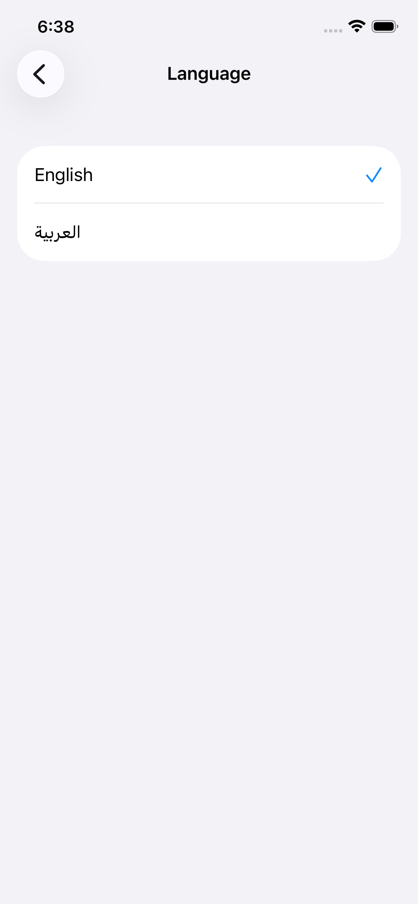
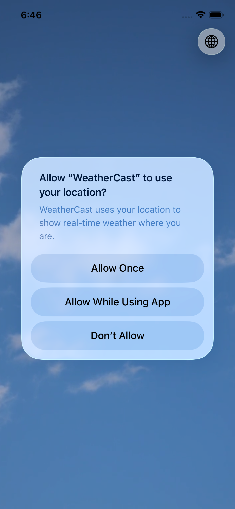
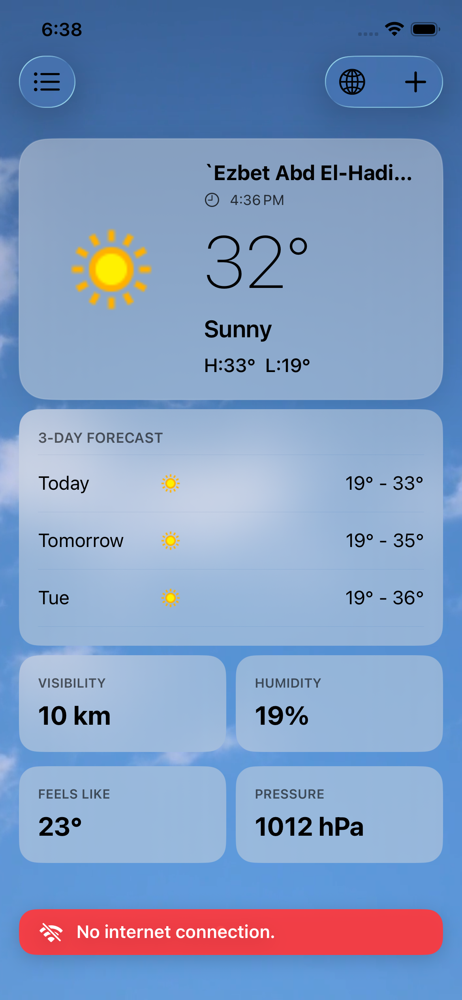
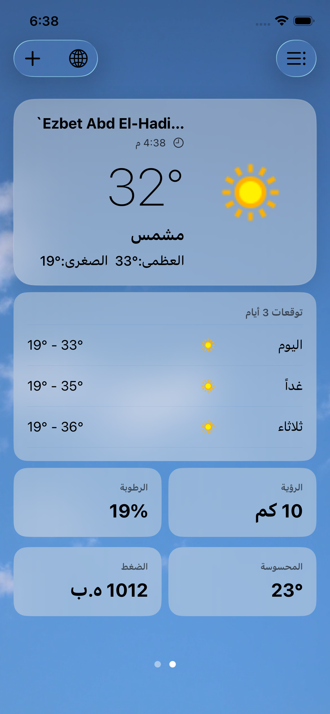

# WeatherCast

WeatherCast is a SwiftUI weather app for iPhone and iPad. It combines current conditions, a three-day forecast, hourly details, location search, saved cities, offline access, and localized English and Arabic experiences in a weather-responsive interface.

## Screens

| Home | Hourly Forecast | Weather Map |
| --- | --- | --- |
|  |  |  |

| City Search | Saved Locations | Language Selection |
| --- | --- | --- |
|  |  |  |

| Location Permission | Offline Mode | Arabic Layout |
| --- | --- | --- |
|  |  |  |

## Features

- Current weather based on the device's location
- Three-day forecast with detailed hourly conditions
- Weather details including feels-like temperature, humidity, visibility, and pressure
- Swipeable forecasts for the current location and saved cities
- Interactive MapKit location picker
- Debounced city search with forecast previews
- Save, select, and remove favorite locations
- SwiftData persistence for saved locations and cached forecasts
- Offline fallback using the latest cached forecast
- Live connectivity banner and automatic refresh after reconnection
- Dynamic day/night video backgrounds for clear, cloudy, foggy, rainy, snowy, and stormy conditions
- English and Arabic localization with full right-to-left layout support
- Location permission, loading, empty, error, and offline states

## Tech Stack

| Area | Technology |
| --- | --- |
| UI | SwiftUI |
| Language | Swift |
| State management | Observation (`@Observable`) |
| Persistence | SwiftData |
| Networking | Alamofire, Swift concurrency (`async`/`await`) |
| Dependency injection | Swinject |
| Maps and location | MapKit, Core Location |
| Media | AVFoundation |
| Localization | String Catalogs, custom locale management |
| API | [WeatherAPI](https://www.weatherapi.com/) |
| Package management | Swift Package Manager |

## Architecture

WeatherCast follows Clean Architecture principles with MVVM in the presentation layer:

```text
Presentation
  SwiftUI Views + Observable ViewModels
            |
            v
Domain
  Entities + Use Cases + Repository Protocols
            |
            v
Data
  Repository Implementations + DTO Mapping
       /                         \
      v                           v
Remote Data Source          Local Data Source
WeatherAPI/Alamofire        SwiftData
```

### Layers

- **Presentation** contains feature-based SwiftUI views and view models for Home, Hourly Forecast, Map, Saved Locations, and Settings.
- **Domain** owns business entities, repository contracts, and use cases. It has no dependency on UI or persistence details.
- **Data** implements domain repositories, maps API DTOs into domain entities, and coordinates remote and local data sources.
- **Core** provides shared networking, location, localization, visual themes, connectivity monitoring, and reusable UI components.
- **DI** uses Swinject assemblies as the composition root and a `ViewFactory` for feature construction and navigation.
- **Persistence** defines the SwiftData models used for favorite locations and cached weather responses.

The repository uses a network-first strategy while online. Successful forecasts are cached by coordinate and language; when the device is offline, the repository returns the matching cached response when available.

## Project Structure

```text
WeatherCast/
├── Core/
│   ├── Config/
│   ├── Extensions/
│   ├── Localization/
│   ├── Location/
│   ├── Network/
│   ├── UI/
│   └── Utils/
├── Data/
│   ├── DTOs/
│   ├── DataSources/
│   └── Repositories/
├── DI/
│   └── Assemblies/
├── Domain/
│   ├── Entities/
│   ├── Protocols/
│   └── UseCases/
├── Persistence/
│   └── SwiftData/
├── Presentation/
│   ├── Home/
│   ├── HourlyForecast/
│   ├── Map/
│   ├── SavedLocations/
│   └── Settings/
└── Resources/
    └── WeatherVideos/
```

## Requirements

- Xcode 26 or later
- iOS/iPadOS 26.0 or later
- A free [WeatherAPI](https://www.weatherapi.com/) API key

## Getting Started

1. Clone the repository:

   ```bash
   git clone <repository-url>
   cd WeatherCast
   ```

2. Create the local secrets configuration:

   ```bash
   cp Secrets.example.xcconfig Secrets.xcconfig
   ```

3. Replace the placeholder in `Secrets.xcconfig`:

   ```xcconfig
   WEATHER_API_KEY = YOUR_WEATHERAPI_KEY
   ```

4. Open `WeatherCast.xcodeproj` in Xcode.
5. Allow Swift Package Manager to resolve Alamofire and Swinject.
6. Select an iOS simulator or device, then build and run.
7. Grant location access to show weather for the device's current position. You can still add locations through the map and city search flow.

`Secrets.xcconfig` is excluded from source control. Keep API credentials out of committed files.

## Data Flow

1. A SwiftUI view sends an action to its view model.
2. The view model calls a domain use case.
3. The use case communicates through a repository protocol.
4. The repository chooses WeatherAPI or SwiftData based on connectivity.
5. DTOs are mapped into domain entities before reaching the presentation layer.
6. Observation updates the SwiftUI interface.

## Dependencies

- [Alamofire](https://github.com/Alamofire/Alamofire) `5.12.0`
- [Swinject](https://github.com/Swinject/Swinject) `2.10.0`

Dependency versions are pinned in `Package.resolved`.

## Privacy

WeatherCast requests location access only while the app is in use. Location coordinates are used to retrieve local weather conditions. Saved locations and cached forecast data are stored locally with SwiftData.

## Acknowledgements

- Weather data provided by [WeatherAPI](https://www.weatherapi.com/)
- Weather video asset attribution is available in `WeatherCast/Resources/WeatherVideos/LICENSE.txt`
